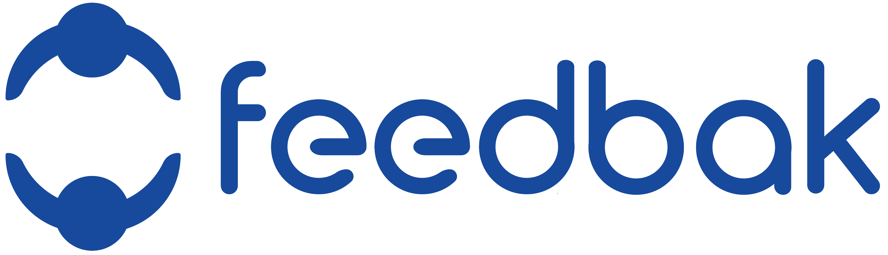

# feedbak - Simplifying Collaboration and Project Management

# Project Description
Feedbak is a web platform that aims to make teamwork feel as natural and easy as chatting with friends. While there are many great project management tools out there, they can be tricky for people new to this kind of software. You often end up jumping between different tabs or tools, and it starts to feel like a chore.

That's precisely the reason why I deveolped feedbak. It's designed to be so simple and intuitive that it feels like a natural extension of how you already work. You can access everything you need without juggling multiple tabs or tools. I wanted Feedbak to be something you could start using right away, without needing a lot of time to figure it out.

Feedbak is dedicated to making teamwork effortless, allowing you to concentrate on what truly matters—achieving your goals together. It's like teamwork on easy mode. No more juggling tabs or getting lost in complex interfaces. Just smooth sailing towards your project goals!

